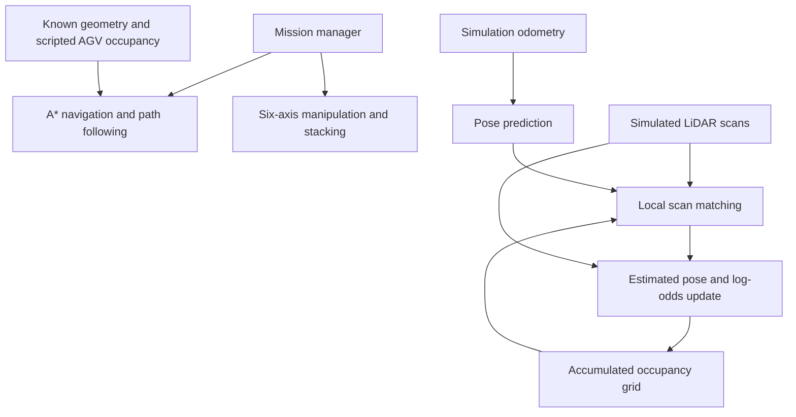
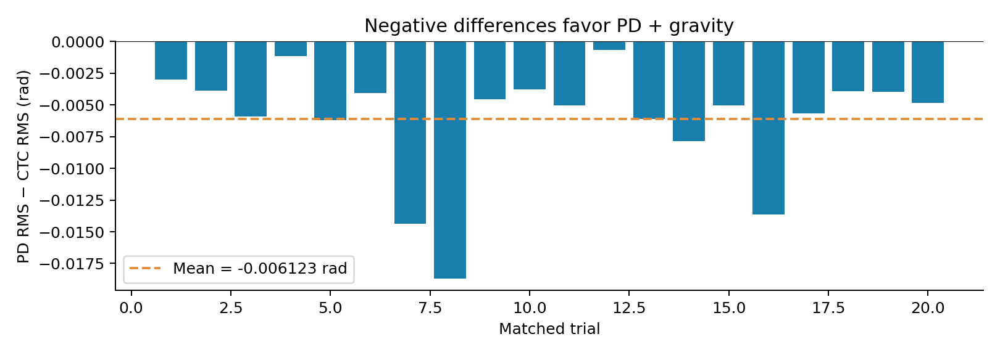

# MATLAB Mobile Manipulator: Navigation, Pick-and-Place, Mapping & Control


A MATLAB simulation of a **four-wheel mobile base carrying a six-axis robotic arm**, integrating waypoint navigation, two-block pick-and-place, scripted AGV crossing stops, live LiDAR mapping and quantitative control evaluation.

**Verified execution environment:** MATLAB R2024a on Windows. The repository includes measured mission data, eight controller experiments, 20 matched Monte Carlo trials and a technical report.

<p align="center">
  
</p>

<p align="center"><b>Navigation · Mobile Manipulation · LiDAR Mapping · Control Evaluation</b></p>

[Simulation MP4](assets/mobile_manipulator_smooth-compressed%20(1)%20(online-video-cutter.com)-compressed.mp4) · [Animated GIF](assets/mobile_manipulator_demo.gif) · [Technical Report](docs/Mobile_Manipulator_Technical_Report.pdf)

The demonstration video is edited. Numerical performance is taken from the saved MATLAB results and execution logs, not from video playback duration.

## Overview

The mission combines:

- Waypoint-constrained **A\*** planning with checked curved path segments and feedback path following.
- Six-axis arm kinematics, quintic trajectories, blue/red block pickup and stacking.
- Protected pickup and placement pads that the mobile base avoids during approach, departure and turning.
- Scripted AGV crossing interlocks, LiDAR sensing and geometric clearance monitoring.
- Live occupancy-grid mapping with incremental odometry prediction and local correlative scan matching.
- A stationary wrist-camera inspection hold with a synthetic scan visualization, followed by dock return.

Separate torque-driven experiments compare **PD + gravity compensation** and **computed-torque control** under nominal payloads, model mismatch, noise and disturbances.

## Documentation

- [Technical report and measured results](docs/Mobile_Manipulator_Technical_Report.pdf)
- [Mathematical model and control implementation](docs/MODEL_AND_CONTROL.md)
- [Evidence provenance](docs/EVIDENCE.md)
- [Simulation media details](docs/MEDIA.md)

## System Architecture



Odometry and LiDAR are separate inputs. The navigation planner uses known simulation geometry; it does **not** plan or replan directly from the estimated occupancy map.

## Mission Sequence

1. **Pick up the blue block:** approach the pickup station, grasp, lift and stow the arm.
2. **Navigate to placement:** follow the extended curved route and stop during scripted AGV crossings.
3. **Place and return:** release the blue block and return to the pickup station.
4. **Pick and stack the red block:** repeat transport and place the red block on the blue block.
5. **Inspect the stack:** move to the inspection pose and remain stationary for six seconds while a synthetic scan sweep is displayed. Inspection uses geometric projection of known block centroids.
6. **Return to dock:** navigate back and regulate the final base position and heading.

## Simulation Interface

| Window | Contents |
|---|---|
| **3D Simulation** | Mobile base, six-axis arm, blocks, obstacles, stations, AGV and route |
| **Live SLAM and Dashboard** | Occupancy map, estimated pose, heading, trajectory, scan endpoints, speed, clearance and mission status |

Both windows follow the same playback timeline. Closing the dashboard leaves the simulation running; closing the simulation stops playback. Video export captures the simulation window only.

## Measured Mission Results


| Metric | MATLAB result |
|---|---:|
| Mission completed | **Yes** |
| Simulated mission duration | **413.05 s** |
| Base travel distance | **113.134 m** |
| Modeled collision samples | **0** |
| Minimum modeled clearance | **0.060003 m** |
| Navigation nearest-path RMS | **0.020103 m** |
| Dock position error | **0.039092 m** |
| AGV crossings | **8** |
| Final inspection hold | **6 s** |
| Processed mapping scans | **2066** |

The two placement residuals are approximately **0.58 µm** and **0.61 µm**. These are numerical results from idealized rigid attachment and should not be interpreted as physical robot accuracy. The collision count refers to violating samples of the modeled geometry, not a hardware safety certification.

## LiDAR Mapping and SLAM Scope


The map starts unknown and updates at **5 Hz** using a **0.10 m occupancy grid**. Incremental simulation odometry predicts pose. Local correlative scan matching aligns LiDAR endpoints with the existing map, and log-odds beam updates accumulate free and occupied cells.

The map displays estimated pose, heading, trajectory and current scan endpoints. Moving AGV returns can leave temporary traces until later observations clear them.

This implementation provides **local scan matching and incremental mapping**. It does not include loop closure or pose-graph optimization. Replay uses ideal simulation odometry and noise-free LiDAR, so near-zero estimated pose error does not demonstrate robustness to real sensor noise or long-term drift.

## Controller Benchmark

The mission arm uses an **acceleration-command servo with inverse-dynamics torque checks**. The separate benchmark integrates **torque-driven arm dynamics**. These are different validation tasks.

The benchmark evaluates both controllers with identical references, torque limits, payload conditions, disturbances and matched random-noise seeds.


| Scenario | PD + gravity RMS (rad) | Computed-torque RMS (rad) |
|---|---:|---:|
| Nominal, 0 kg | 0.00162835 | **0.00021985** |
| Nominal, 1 kg | 0.00255107 | **0.00021985** |
| Nominal, 2 kg | 0.00373531 | **0.00021985** |
| 2 kg + 20% mass mismatch + noise + disturbance | **0.01688337** | 0.04747052 |

RMS pools all six joints and time samples. Computed torque achieves lower RMS in the three nominal cases; PD + gravity achieves lower RMS in the combined stress case. Under stress, computed torque still has a smaller terminal joint-error norm, so conclusions depend on the chosen metric.

The comparison applies to the supplied model, gains, trajectory and test conditions.

## Monte Carlo Uncertainty Analysis

The study contains **20 matched scenarios: 40 controller runs in total**. Sampling varies payload from 0–2 kg, link mass/inertia scale from 0.85–1.15, and position-noise standard deviation from 0.001–0.005 rad. Each pair uses the same scenario and noise seed.

| Statistic | Result |
|---|---:|
| Mean PD + gravity RMS | **0.007494 rad** |
| Mean computed-torque RMS | **0.013617 rad** |
| Mean paired difference, PD minus CTC | **−0.006123 rad** |
| Trials with lower PD RMS | **20 of 20** |

<p align="center">
  
</p>

Negative differences favor PD + gravity. The results show lower RMS sensitivity for the supplied PD configuration under these sampled uncertainties. They are not a universal ranking of the two control methods. The report provides the paired confidence interval and further interpretation.

## Requirements and Running

The recorded user run used **MATLAB R2024a on Windows**. The project uses base MATLAB functionality; video export uses `VideoWriter`.

Open the repository root as MATLAB **Current Folder**.

### Replay the supplied measured mission

```matlab
clear functions
replay_simulation
```

### Recompute the main suite

```matlab
run_all_results
```

This runs numerical model tests, the complete mission, station-clearance and AGV checks, mapping checks, and eight controller trials. An existing `results` folder is archived before fresh results are generated. Replay opens after the suite completes.

### Complete workflow, including uncertainty trials and video

Run each command after the previous one has finished:

```matlab
run_all_results
run_monte_carlo(20)
export_video(30,2)
package_results
```

The video export uses 30 FPS and 2× playback speed. Keep the simulation window open until export finishes. `package_results` writes `MATLAB_Results_For_Review.zip`.

To rerun controller experiments while keeping an existing saved mission:

```matlab
resume_results
```

## Repository Guide

| Location | Actual files and purpose |
|---|---|
| `assets/` | `mobile_manipulator_smooth-compressed (1) (online-video-cutter.com)-compressed.mp4`, `mobile_manipulator_demo.gif`, `controller_summary.png`, `monte_carlo_difference.png` |
| `docs/` | Technical report PDF, `MODEL_AND_CONTROL.md`, `EVIDENCE.md`, `MEDIA.md`, `GITHUB_UPLOAD.md` |
| `results/` | Supplied mission, controller and Monte Carlo MAT/CSV data; MATLAB log; result figures |
| `src/` | MATLAB functions such as `mm_fk.m`, `mm_ik.m`, `mm_rne.m`, `mm_astar.m`, `mm_drive.m`, `mm_lidar.m`, `mm_slam_step.m` and `mm_animate.m` |
| `tests/` | `run_tests.m`, `test_long_route.m`, `test_station_clearance.m`, `test_slam.m`, `test_renderer.m` |
| Repository root | `run_project.m`, `run_all_results.m`, `run_experiments.m`, `run_monte_carlo.m`, `resume_results.m`, `replay_simulation.m`, `export_video.m`, `package_results.m` |

## Validation and Limitations

The supplied MATLAB log records passing kinematics, Jacobian, mass-matrix, gravity, trajectory, planning and LiDAR checks, followed by successful mission, crossing, station-clearance and mapping checks. The repository preserves the numerical evidence separately from edited demonstration media.

The current model uses:

- Simplified collision geometry without full robot self-collision or realistic contact dynamics.
- Rigid-attachment grasping without force or grasp-stability modeling.
- Known environment geometry and scripted AGV lane occupancy.
- Idealized mobile-base motion without wheel slip or base/arm dynamic coupling.
- Synthetic inspection based on known block locations, not image-based recognition.
- Local mapping without loop closure, global optimization or real sensor calibration.

Results describe this simulated workcell and the supplied controller settings. No physical robot deployment or real-world safety validation is claimed.

## Future Work

Potential extensions include ROS 2 integration, Gazebo contact and sensor simulation, Nav2 and SLAM Toolbox navigation/mapping, MoveIt 2 manipulation, RGB/RGB-D perception, and hardware experiments. These are future directions, not implemented features.

The next evaluation priorities are noisy odometry and LiDAR, independent map-quality metrics, controller tuning across uncertainty levels, and measurement of the simulation-to-reality gap.

## Author

**Ruddrho Mollik — Robotics & Control Systems**

[GitHub profile](https://github.com/ruddrho) · [Project repository](https://github.com/ruddrho/matlab-mobile-manipulator-slam-control)
