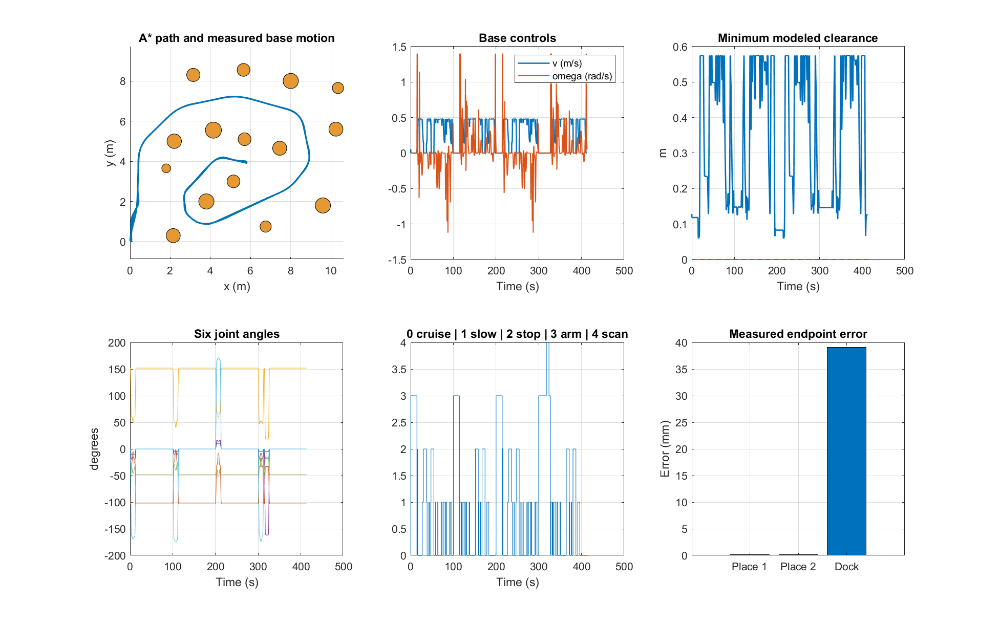
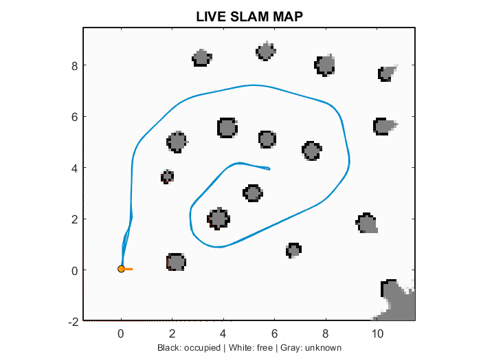
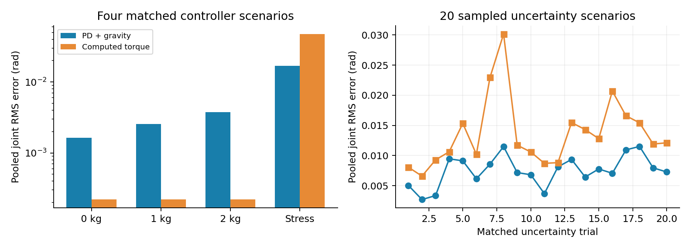

# MATLAB Mobile Manipulator: Navigation, Pick-and-Place, SLAM & Control

A reproducible MATLAB robotics simulation integrating **autonomous mobile navigation, six-axis robotic manipulation, pick-and-place, multi-block stacking, dynamic AGV interaction, LiDAR sensing, live occupancy-grid mapping, controller benchmarking and Monte Carlo robustness analysis**.

**Verified environment:** MATLAB R2024a on Windows.

<p align="center">
  
</p>

<p align="center">
  <b>Navigation • Mobile Manipulation • LiDAR Mapping • Pick-and-Place • Control Evaluation</b>
</p>

---

## Project Overview

This project simulates a **four-wheel autonomous mobile base carrying a six-axis robotic arm**.

The complete mission integrates:

- Waypoint-constrained **A\*** navigation
- Curved mobile-robot path following
- Dynamic AGV crossing stops
- Six-axis robotic-arm manipulation
- Blue and red block pick-and-place
- Two-block stacking
- Synthetic wrist-camera inspection
- LiDAR range sensing
- Incremental occupancy-grid mapping
- Local correlative scan matching
- Dock-return verification
- PD + gravity-compensation control
- Computed-torque control
- Payload and model-mismatch experiments
- Monte Carlo uncertainty analysis

The repository contains MATLAB source code, tests, measured results, figures, simulation media, controller experiments and technical documentation.

---

## Documentation

- [Technical Report](docs/Mobile_Manipulator_Technical_Report.pdf)
- [Model and Control Documentation](docs/MODEL_AND_CONTROL.md)
- [Evidence and Result Provenance](docs/EVIDENCE.md)

---

# Simulation Demo

<p align="center">
  <a href="assets/mobile_manipulator_smooth-compressed%20(1)%20(online-video-cutter.com)-compressed.mp4">
    
  </a>
</p>

### Media

- [Watch / Download Simulation MP4](assets/mobile_manipulator_smooth-compressed%20(1)%20(online-video-cutter.com)-compressed.mp4)
- [View Animated GIF](assets/mobile_manipulator_demo.gif)

The supplied demonstration video is an edited visualization of the MATLAB simulation.

Reported numerical performance values are taken from the measured MATLAB results and execution logs rather than from video duration.

---

# System Architecture

The project combines autonomous navigation, robotic manipulation, sensing, mapping and control within one coordinated mobile-manipulator mission.

```text
                     Mission Manager
                           │
            ┌──────────────┴──────────────┐
            │                             │
            ▼                             ▼
     Mobile Navigation              6-DOF Manipulator
            │                             │
            ▼                             ▼
      A* / Waypoints                Pick-and-Place
      Path Tracking                 Block Stacking
            │
            ▼
        LiDAR Sensor
            │
            ▼
     Odometry Prediction
            │
            ▼
  Local Scan Matching
            │
            ▼
  Occupancy-Grid Mapping
```

---

# Mission Sequence

## 1. Blue Block Pickup

The mobile base approaches the pickup station.

The six-axis manipulator then:

- Moves toward the pickup location
- Grasps the blue block
- Lifts the object
- Prepares for transport

## 2. Navigation and AGV Interaction

The mobile manipulator follows the planned curved route toward the placement station.

During navigation, scripted AGV lane occupancy is monitored.

When the AGV occupies the crossing region, the mobile robot stops and resumes after the crossing becomes clear.

## 3. Blue Block Placement and Return

The robot reaches the target station and places the blue block.

The mobile manipulator then returns to the pickup area for the second object.

## 4. Red Block Pickup and Stacking

The six-axis arm picks up the red block and transports it to the placement station.

The red block is then stacked on the previously placed blue block.

## 5. Wrist-Camera Inspection

After stacking, the manipulator performs a synthetic inspection sweep.

The final inspection includes a **six-second hold**.

## 6. Autonomous Dock Return

After completing manipulation and inspection, the mobile robot returns to its docking location.

Dock-position accuracy is evaluated numerically.

---

# Mission Safety Constraints

Pickup and placement areas are protected from mobile-base travel.

These restrictions remain active during:

- Approach
- Departure
- Turning
- Pickup
- Placement
- Stacking

Additional geometric safeguards are used around the scripted AGV crossing.

---

# Simulation Interface

The simulation and monitoring components are separated into dedicated visualization windows.

## 3D Simulation Window

Displays:

- Mobile base
- Six-axis robotic arm
- Blocks
- Obstacles
- Pickup station
- Placement station
- AGV
- Navigation route
- Manipulator motion

## Live Monitoring Window

Displays:

- Occupancy map
- Estimated robot pose
- Heading
- LiDAR scan
- Robot trajectory
- Speed
- Obstacle clearance
- Mission state
- Mapping status

---

# Measured Mission Results



| Metric | MATLAB Result |
|---|---:|
| Mission completed | **Yes** |
| Simulated mission duration | **413.05 s** |
| Base travel distance | **113.134 m** |
| Modeled collision samples | **0** |
| Minimum modeled clearance | **0.060003 m** |
| Navigation nearest-path RMS | **0.020103 m** |
| Dock position error | **0.039092 m** |
| AGV crossings | **8** |
| Final inspection hold | **6 s** |
| Processed mapping scans | **2066** |

The complete mission was executed successfully in the supplied simulation with **zero modeled collision samples**.

---

# Placement Accuracy

The two simulated placement errors are approximately:

- **0.58 µm**
- **0.61 µm**

These values are obtained from an idealized rigid-attachment simulation and should **not** be interpreted as physical robot accuracy measurements.

Real hardware performance would additionally depend on calibration, encoder resolution, backlash, gripper compliance, structural deformation, contact mechanics and sensor noise.

---

# Autonomous Navigation

The mobile robot uses waypoint-constrained **A\*** planning together with continuous path tracking.

The navigation subsystem handles:

- Global route generation
- Curved waypoint sequences
- Path following
- Obstacle avoidance
- Protected station regions
- AGV crossing stops
- Clearance monitoring
- Autonomous dock return

The current planner uses known obstacle geometry from the simulation environment and does not currently replan directly from the estimated occupancy map.

---

# LiDAR Mapping



| Parameter | Value |
|---|---:|
| Mapping update rate | **5 Hz** |
| Occupancy-grid resolution | **0.10 m** |
| Processed mapping scans | **2066** |

The map begins in an unknown state and is updated incrementally while the robot navigates.

## Mapping Pipeline

```text
LiDAR Scan
    │
    ▼
Simulation Odometry
    │
    ▼
Pose Prediction
    │
    ▼
Local Correlative Scan Matching
    │
    ▼
Pose Correction
    │
    ▼
Log-Odds Beam Update
    │
    ▼
Occupancy Grid
```

The live map displays:

- Estimated pose
- Robot heading
- Trajectory
- Scan endpoints
- Occupied cells
- Free cells
- Unknown space

---

# SLAM Scope

The implemented mapping system includes:

- Incremental odometry prediction
- Local scan matching
- Range-based occupancy updates
- Online map construction

The current implementation does **not** include:

- Loop closure
- Pose-graph optimization
- Global bundle adjustment
- Long-term drift correction
- Real sensor calibration

Replay uses ideal simulation odometry and noise-free simulated LiDAR.

Therefore, near-zero estimated pose error in this simulation should not be interpreted as proof of real-world SLAM robustness.

---

# Six-Axis Robotic Manipulator

The mobile platform carries a six-axis robotic arm responsible for:

- Pickup approach
- Grasp execution
- Object lifting
- Transport
- Placement
- Block stacking
- Wrist-camera inspection motion

The mission arm uses an acceleration-command servo together with inverse-dynamics torque checks.

---

# Controller Benchmark

A separate torque-driven manipulator benchmark compares:

- **PD + Gravity Compensation**
- **Computed-Torque Control**

Both controllers are evaluated using identical references, torque limits, matched noise seeds, payload conditions and disturbance conditions.



---

# Controller Results

| Scenario | PD RMS (rad) | Computed-Torque RMS (rad) |
|---|---:|---:|
| Nominal, 0 kg | 0.00162835 | **0.00021985** |
| Nominal, 1 kg | 0.00255107 | **0.00021985** |
| Nominal, 2 kg | 0.00373531 | **0.00021985** |
| 2 kg + 20% mass mismatch + noise + disturbance | **0.01688337** | 0.04747052 |

Computed-torque control achieves lower RMS tracking error in the three nominal payload cases.

Under the combined stress scenario, the supplied PD + gravity-compensation configuration records lower RMS tracking error.

This result applies specifically to the supplied model, gains, trajectories and test conditions.

---

# Monte Carlo Robustness Study

A matched **20-trial uncertainty analysis** was performed to compare **PD + Gravity Compensation** against **Computed-Torque Control (CTC)** under the same sampled uncertainty conditions.

| Controller | Mean RMS Error |
|---|---:|
| PD + Gravity Compensation | **0.007494 rad** |
| Computed-Torque Control | **0.013617 rad** |

<p align="center">
  
</p>

<p align="center">
  <b>Matched-trial RMS difference: PD RMS − CTC RMS</b>
</p>

Negative values indicate that **PD + Gravity Compensation achieved lower RMS tracking error** than Computed-Torque Control for the corresponding matched trial.

The mean matched difference was approximately **−0.006123 rad**, and all 20 sampled trials produced negative differences in the supplied experiment.

These results indicate better robustness of the supplied PD + gravity-compensation configuration under the tested uncertainty conditions. They apply specifically to the implemented model, controller gains, disturbance assumptions and sampled uncertainty range, and should not be interpreted as a universal ranking of the two control methods.

---

# Wrist-Camera Inspection

The final manipulation stage includes a synthetic wrist-camera inspection sweep.

The current implementation uses:

- Known block locations
- Geometric projection
- Wrist motion
- Synthetic inspection timing

It does not currently perform real image-based perception or object recognition.

---

# Key Features

- MATLAB robotics simulation
- Four-wheel autonomous mobile robot
- Six-axis robotic manipulator
- Mobile-manipulator mission
- A\* path planning
- Curved waypoint navigation
- Dynamic AGV crossing logic
- Collision monitoring
- Pick-and-place
- Multi-block stacking
- Wrist-camera inspection
- LiDAR sensing
- Occupancy-grid mapping
- Local scan matching
- Live pose visualization
- Dock-return verification
- PD + gravity compensation
- Computed-torque control
- Payload testing
- Disturbance testing
- Model-mismatch testing
- Monte Carlo uncertainty analysis
- Automated numerical verification
- Reproducible result generation

---

# Requirements

Verified environment:

```text
MATLAB R2024a
Windows
```

The project primarily uses base MATLAB functionality.

Video export uses MATLAB `VideoWriter`.

---

# Running the Project

Clone or download the repository and open the repository directory as the MATLAB **Current Folder**.

## Replay the Supplied Mission

```matlab
clear functions
replay_simulation
```

## Recompute the Main Result Suite

```matlab
run_all_results
```

The main suite runs:

- Numerical model tests
- Full mobile-manipulator mission
- Navigation checks
- Station-clearance checks
- AGV interaction checks
- Mapping checks
- Controller trials

## Run Monte Carlo Analysis

```matlab
run_monte_carlo(20)
```

## Export Simulation Video

```matlab
export_video(30,2)
```

## Package Results

```matlab
package_results
```

## Complete Experiment Workflow

```matlab
run_all_results
run_monte_carlo(20)
export_video(30,2)
package_results
```

## Resume Controller Experiments

```matlab
resume_results
```

---

# Repository Structure

```text
matlab-mobile-manipulator-slam-control/
│
├── assets/
│   ├── mobile_manipulator_demo.gif
│   ├── mobile_manipulator_smooth-compressed (1)
│   │   (online-video-cutter.com)-compressed.mp4
│   └── controller_summary.png
│
├── docs/
│   ├── Mobile_Manipulator_Technical_Report.pdf
│   ├── MODEL_AND_CONTROL.md
│   └── EVIDENCE.md
│
├── results/
│   ├── mission_analysis.png
│   ├── live_slam_map.png
│   ├── MAT files
│   ├── CSV measurements
│   └── execution logs
│
├── src/
│   ├── kinematics
│   ├── dynamics
│   ├── planning
│   ├── sensing
│   ├── mapping
│   └── rendering
│
├── tests/
│   ├── model tests
│   ├── mission tests
│   ├── station-clearance tests
│   ├── mapping tests
│   └── renderer tests
│
├── replay_simulation.m
├── run_all_results.m
├── run_monte_carlo.m
├── resume_results.m
├── export_video.m
├── package_results.m
└── README.md
```

---

# Result Reproducibility

The repository separates:

1. Mission simulation results
2. Controller experiments
3. Monte Carlo analysis
4. Visualization media
5. Technical documentation

This separation helps distinguish numerical evidence from edited demonstration media.

---

# Scope and Limitations

This repository represents a **simulation research project**, not a physical robot deployment.

Important limitations include:

- Simplified collision checking
- Rigid-attachment grasping
- Scripted AGV interaction
- Synthetic wrist-camera inspection
- No loop closure or pose-graph optimization
- Navigation based on known obstacle geometry
- No physical sensor calibration
- No real-robot safety validation

The mission arm and the torque-driven controller benchmark also represent different validation tasks and should not be treated as identical experiments.

---

# Future Work

Future development will focus on extending the current MATLAB baseline toward a more realistic robotics stack.

Planned directions include:

- **ROS 2** integration for modular navigation, sensing, manipulation and mission control
- **Gazebo** physics simulation with realistic robot dynamics, contacts and sensor noise
- **Nav2** and **SLAM Toolbox** for map-based autonomous navigation and SLAM
- **MoveIt 2** for collision-aware manipulator motion planning and pick-and-place
- RGB/RGB-D perception for object detection, localization and grasp verification
- Real mobile-manipulator experiments for navigation, mapping and manipulation validation

A longer-term goal is to compare the same mission across:

```text
MATLAB Simulation
       ↓
ROS 2 + Gazebo
       ↓
Real Mobile Manipulator
```

This progression would allow quantitative evaluation of the **simulation-to-reality gap**.

---

# Research Value

The project demonstrates the integration of multiple robotics subsystems within one complete mission:

```text
Path Planning
     ↓
Navigation
     ↓
Mobile Manipulation
     ↓
Dynamic AGV Interaction
     ↓
LiDAR Sensing
     ↓
Mapping
     ↓
Manipulator Control
     ↓
Quantitative Validation
```

The focus is on the interaction between **planning, navigation, manipulation, sensing, mapping and control**, rather than on isolated algorithms alone.

---

# Repository Topics

```text
matlab
robotics
mobile-robot
mobile-manipulator
robot-arm
robot-manipulator
slam
lidar
occupancy-grid
path-planning
a-star
autonomous-navigation
pick-and-place
robot-control
computed-torque-control
pd-control
control-systems
robotics-simulation
mapping
monte-carlo
```

---

# License

This project is licensed under the **MIT License**.

See the [LICENSE](LICENSE) file for details.

---

# Author

## Ruddrho Mollik

**Robotics & Control Systems**

GitHub: [@ruddrho](https://github.com/ruddrho)

Repository:  
[matlab-mobile-manipulator-slam-control](https://github.com/ruddrho/matlab-mobile-manipulator-slam-control)

---

<p align="center">
  <b>Developed by Ruddrho Mollik</b>
</p>
